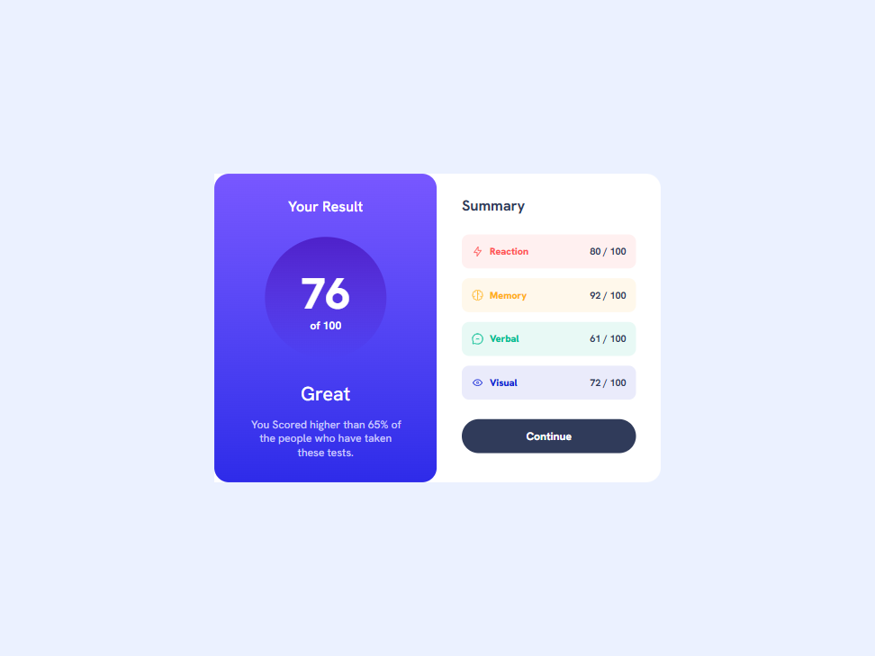
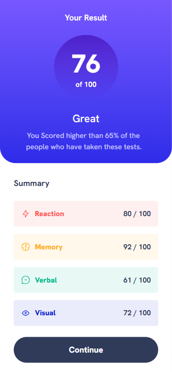

# Frontend Mentor - Results summary component solution

This is a solution to the [Results summary component challenge on Frontend Mentor](https://www.frontendmentor.io/challenges/results-summary-component-CE_K6s0maV). Frontend Mentor challenges help you improve your coding skills by building realistic projects.

## Table of contents

- [Overview](#overview)
  - [The challenge](#the-challenge)
  - [Screenshot](#screenshot)
  - [Links](#links)
- [My process](#my-process)
  - [Built with](#built-with)
  - [What I learned](#what-i-learned)
  - [Useful resources](#useful-resources)
- [Author](#author)

## Overview

### The challenge

Users should be able to:

- View the optimal layout for the interface depending on their device's screen size
- See hover and focus states for all interactive elements on the page
- **Bonus**: Use the local JSON data to dynamically populate the content

### Screenshot

### Links

- Solution URL: [https://www.frontendmentor.io/solutions/results-summary-component-using-react-tailwind-css-and-json-data-iEHUn7yI_O](https://www.frontendmentor.io/solutions/results-summary-component-using-react-tailwind-css-and-json-data-iEHUn7yI_O)
- Live Site URL: [https://fadymas.github.io/results-summary-component-main/](https://fadymas.github.io/results-summary-component-main/)

## My process

### Built with

- Semantic HTML5 markup
- CSS custom properties
- Flexbox
- Mobile-first workflow
- [Tailwind](https://tailwindcss.com/) - Css library
- [React](https://react.dev/) – for building UI components
- [Vite](https://vitejs.dev/) – as a build tool

### What I learned

In this project, I learned how to work with React by creating small reusable components (components architecture), keeping them pure so they always return the same result for the same input (pure functions), passing data with props (props), and managing changes with useState (state). I also used useEffect (side effects) to fetch and show the data when the component loads. In addition, I practiced conditional rendering (conditional render) to display loading states and skeletons before the data is ready.

### Useful resources

- [Tailwind CSS Documentation](https://tailwindcss.com/docs) – Helped me understand how to use responsive utility classes and how to apply spacing, typography, and custom colors effectively.

- [React documentation – “Learn React”](https://react.dev/learn) – The official React guide that introduces key concepts.

## Author

- Frontend Mentor - [@fadymas](https://www.frontendmentor.io/profile/fadymas)

- LinkedIn - [@fady-mahros](www.linkedin.com/in/fady-mahrous)

- X Twitter - [@FadyMahrous](https://x.com/fadymahros941);

- Instgram - [@FadyMahrous](https://www.instagram.com/fadymahros373/)
